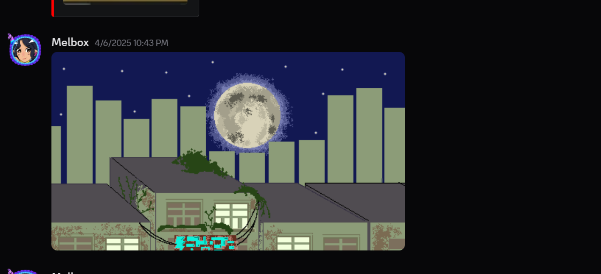

# 🎮 3370-2DGame, Title: Catpocalypse

## 👥 Group Members
- Melanie Loredo  
- Luis Sepulveda  
- Obed Mendoza  

## 🎮 Game Definition
- **Premise:** The protagonist, Cat is lost in the city and has to find a way back home defeating aliens and drones by using a robot suit that can fight back. 
- **Setting:** A post-apocalyptic city overrun with hostile aliens and robots  
- **Inspiration:** *Stray, Jetpack Joyride, Subway Surfers*  

## 🐱 Characters
- **Protagonist - Curious Cat:** Curious Cat is lost and wants to return home, and finds an abandoned robot suit to defend itself.
- **Enemies - Zurks (Aliens):** Alien creatures that chase and attach to the cat; they must be destroyed to disappear.  
- **Sentinels (Drones):** Programmed to attack their surroundings, but not specifically targeting the cat.  

## ⚡ Actions and Consequences
- 🔴 **If the cat crashes into an enemy, it loses a life.**  
- ⚡ **The cat can dash.**  
- 🐟 **Grabbing a Tuna heals the cat.**  
- 🐀 **Grabbing a Rat grants a temporary life (max 9).**  
- 🔥 **The cat can grab a power-up to change the fire type of the suit.**  
- 🎯 **Collectible items increase the overall score.**  

## Melanie's 1st Delivery Contribution

Ideas contributed via call and art contributed:
- Cat Coin - https://www.tinkercad.com/things/4cX9HpRqrVv-cat-coin?sharecode=pjv2M62MR8_ifoTDiECu6e0EClMB5a5sD1ZSveDjGsI

## Obed's 1st Delivery Contribution

- Building1 - https://www.tinkercad.com/things/hkKXr0ljOMH-city-building/edit?returnTo=https%3A%2F%2Fwww.tinkercad.com%2Fdashboard&sharecode=CE93vSt95fw4VUUgvg4l7fDs9IWM9gz0ZZfND3gPcDE

- Building2 - https://www.tinkercad.com/things/di5B4oJxDyz-city-building/edit?returnTo=https%3A%2F%2Fwww.tinkercad.com%2Fdashboard%2Fdesigns%2F3d&sharecode=UWn3CEwuiuPiHy5E64SVSIYpVD4HfrDSATjnZmPsMTQ
